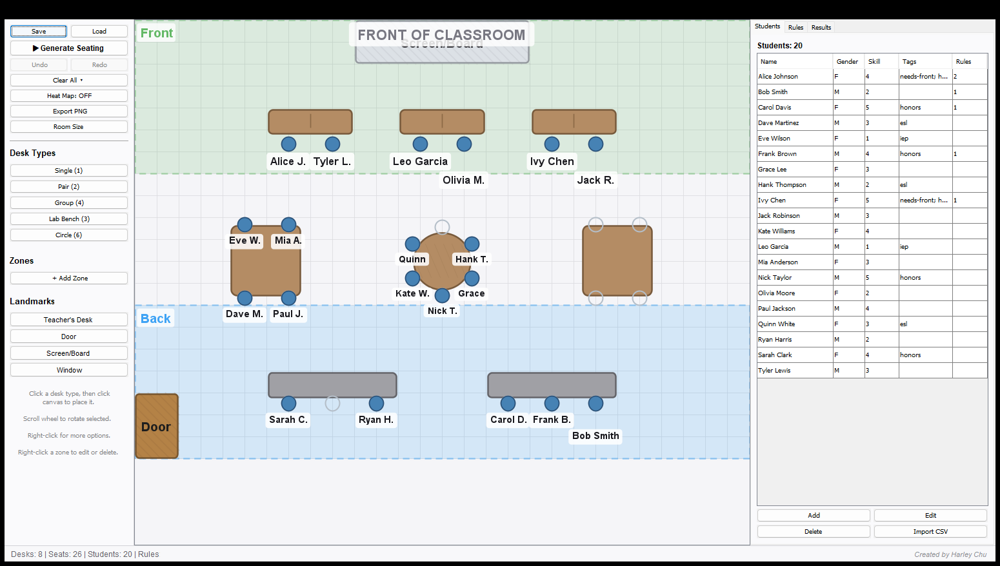

# SeatSolver

**Classroom seating arrangement generator with constraint satisfaction solver.**



SeatSolver is a Java Swing application that lets teachers design classroom layouts by dragging and dropping desk types onto a canvas, then automatically generates optimal seating arrangements using a constraint satisfaction algorithm. Define rules like "keep these students apart" or "put this student in the front zone" and the solver finds arrangements that satisfy all constraints — usually in under 100 milliseconds.

---

## Quick Start

### Windows (recommended)

1. Download `SeatSolver-Windows.zip` from the [latest release](../../releases/latest)
2. Extract the zip (right-click → Extract All)
3. Open the `SeatSolver` folder and double-click `SeatSolver.exe`

No Java installation required.

> **Note:** If Windows shows a SmartScreen warning, click "More info" then "Run anyway."

### Mac / Linux (requires Java 11+)

1. Download `SeatSolver.jar` from the [latest release](../../releases/latest)
2. Run from terminal:
   ```
   java -jar SeatSolver.jar
   ```

### Build from Source

```bash
git clone https://github.com/AccelerateHumanity/SeatSolver.git
cd SeatSolver
./gradlew build         # compile + test
./gradlew run           # launch the application
./gradlew jar           # build standalone JAR at build/libs/SeatSolver-*.jar
./gradlew zipAppImage   # build Windows app with bundled JRE (requires JDK 17+)
```

---

## Features

- **5 desk types** — Single, Pair, Group Table, Lab Bench, Circle Table
- **Drag-and-drop** placement with grid snapping and collision detection
- **Classroom landmarks** — Teacher desk, door, screen, window (draggable, rotatable)
- **Multi-select** — Rectangle drag to select, group move/rotate/delete/duplicate
- **Room templates** — Rows, Groups, Lab, Perimeter layouts
- **3 constraint types** — Proximity (apart/together), Zone (front/back), Balance (gender/skill)
- **CSP solver** with MRV heuristic, forward checking, and local search optimization
- **Multiple solutions** — Generates up to 5 ranked arrangements
- **Heat map overlay** — Green-to-red visualization of constraint satisfaction per seat
- **Conflict overlay** — Red dashed lines between students violating proximity rules
- **Full undo/redo** — Ctrl+Z / Ctrl+Y for all desk and landmark operations
- **Save/Load** — JSON project files preserving desks, students, constraints, zones
- **CSV import** — Bulk student roster import
- **PNG export** — High-resolution seating chart images
- **Disco mode** — Easter egg with bouncing desk physics (Ctrl+D)

---

## Keyboard Shortcuts

| Shortcut | Action |
|----------|--------|
| `Ctrl+Z` | Undo |
| `Ctrl+Y` | Redo |
| `Delete` | Delete selected desk(s) or landmark |
| `Escape` | Cancel selection / exit modes |
| `Ctrl+D` | Disco mode (easter egg) |
| `Scroll wheel` | Rotate selected desk (15 deg/tick) |

---

## Example Files

The `examples/` directory includes ready-to-use classroom configurations:

| File | Description |
|------|-------------|
| `full_demo.json` | 20 students, 8 desks, 5 constraints |
| `traditional_rows.json` | Pair desks in row layout |
| `group_tables.json` | Group table arrangement |
| `computer_lab.json` | 3-wall perimeter lab benches |
| `students.csv` | 24-student roster for CSV import |

---

## Architecture

```
seating/
├── SeatingApp.java          Entry point
├── model/                   Data models (Desk hierarchy, Student, Seat, Zone, Classroom)
├── constraint/              Constraint system (Proximity, Zone, Balance)
├── solver/                  CSP solver + adjacency graph
├── layout/                  Command pattern (undo/redo) + grid management
├── io/                      JSON save/load
└── ui/                      Swing GUI (canvas, panels, overlays)
```

### Data Structures

| Structure | Class | Purpose |
|-----------|-------|---------|
| **Graph** | `SeatGraph` | Adjacency list (`HashMap<Seat, Set<Seat>>`) for seat neighbor relationships |
| **PriorityQueue** | `CSPSolver` | MRV heuristic — selects most constrained student first |
| **Stack** | `UndoManager` | Dual undo/redo stacks via Command pattern |
| **HashMap** | Throughout | Seat assignments, solver domains, constraint lookups |

### Inheritance

- **`abstract Desk`** → `SingleDesk`, `PairDesk`, `GroupTable`, `LabBench`, `CircleTable`
- **`interface Constraint`** → `ProximityConstraint`, `ZoneConstraint`, `BalanceConstraint`
- **`interface Command`** → `AddDeskCommand`, `MoveDeskCommand`, `RotateDeskCommand`, `DeleteDeskCommand`, + landmark commands

---

## License

[MIT](LICENSE)
